# Modul 7 - Profiling 

**Nama:** Izzudin Abdul Rasyid  
**NPM:** 2406495786  

---

## 🔍 Before Optimization 

Pada tahap ini, aplikasi dijalankan menggunakan data *dummy* sebanyak 5.000 data `Student` dan 10.000 data relasi `StudentCourse`. Pengujian beban (*load testing*) dilakukan menggunakan **Apache JMeter** dengan skenario 10 *Thread* (Users) yang dieksekusi secara bersamaan.

Berikut adalah hasil analisis performa dan identifikasi masalah (*bottleneck*) pada ketiga *endpoint* sebelum dilakukan optimasi:

### 1. Endpoint `/all-student` 

**Penjelasan Masalah:**
Endpoint ini memiliki performa yang sangat lambat karena mengalami masalah **N+1 Query** pada Hibernate. Di dalam `StudentService.java`, aplikasi menarik seluruh daftar mahasiswa dari database (1 *query*), kemudian melakukan *looping* untuk setiap mahasiswa guna menarik data *course* mereka menggunakan `findByStudentId` (5.000 *query* tambahan). Total terdapat **5.001 query** yang dieksekusi ke PostgreSQL dalam satu kali *request*.

**Hasil Uji Coba JMeter:**
Berdasarkan pengujian, masalah N+1 Query ini menyebabkan antrean proses I/O ke database yang sangat berat, membuat waktu respons anjlok.
* **Average Load Time (GUI):** 6.798 ms (Lebih dari 6 detik).
* **Average Load Time (CLI):** 6.250 ms.

**Bukti Eksekusi JMeter GUI:**
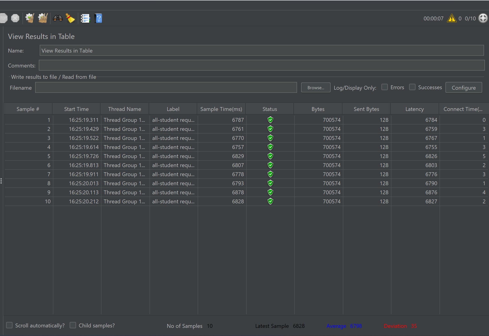

**Bukti Eksekusi JMeter Terminal (CLI):**
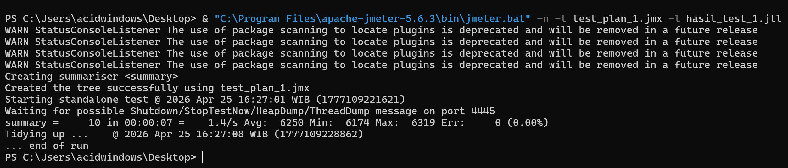

**Hasil JMeter Test Logs:**
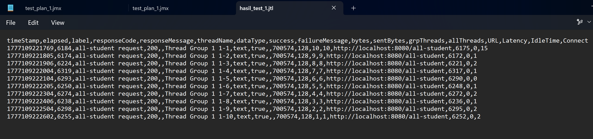

---

### 2. Endpoint `/all-student-name`

**Penjelasan Masalah:**
Walaupun waktu respons tergolong cepat, terdapat pemborosan memori dan CPU yang signifikan:
1. **Overfetching:** Aplikasi menggunakan `studentRepository.findAll()` yang setara dengan `SELECT * FROM students`. Seluruh kolom (termasuk `id`, `faculty`, `gpa`) ditarik ke RAM, padahal yang dibutuhkan hanyalah kolom `name`.
2. **Inefficient Concatenation:** Penggunaan operator `+=` di dalam *looping* sangat membebani *Garbage Collector* Java karena sifat *String* yang *immutable* (menciptakan ribuan objek *String* baru secara repetitif).

**Hasil Uji Coba JMeter:**
* **Average Load Time (GUI):** 52 ms.
* **Average Load Time (CLI):** 52 ms.

**Bukti Eksekusi JMeter GUI:**
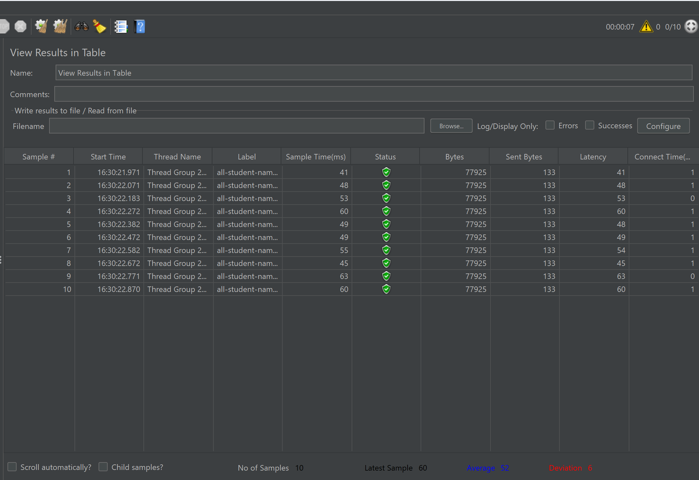

**Bukti Eksekusi JMeter Terminal (CLI):**
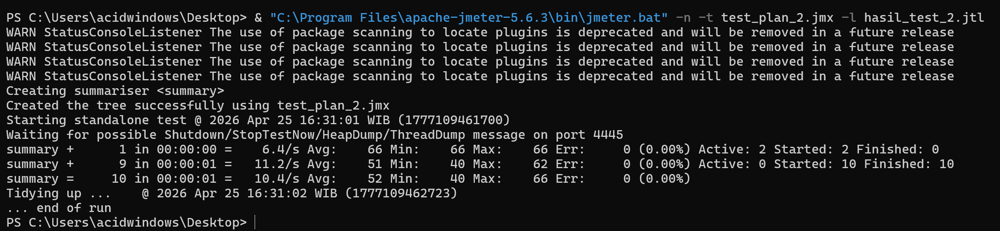

**Hasil JMeter Test Logs:**
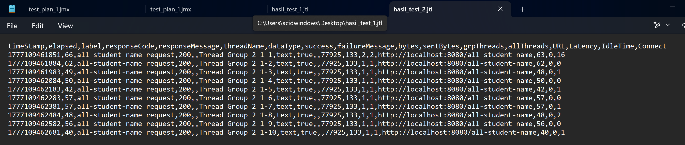

---

### 3. Endpoint `/highest-gpa`

**Penjelasan Masalah:**
Metode `findStudentWithHighestGpa()` melakukan *anti-pattern* dengan menarik seluruh 5.000 baris data mahasiswa ke memori aplikasi Java hanya untuk mencari satu nilai GPA tertinggi melalui *looping*. Proses komputasi/pencarian ini seharusnya diserahkan kepada Database Management System (DBMS). Jika data diskalakan hingga jutaan, *endpoint* ini berpotensi besar menyebabkan **Out of Memory (OOM) Error**.

**Hasil Uji Coba JMeter:**
* **Average Load Time (GUI):** 30 ms.
* **Average Load Time (CLI):** 35 ms.

**Bukti Eksekusi JMeter GUI:**
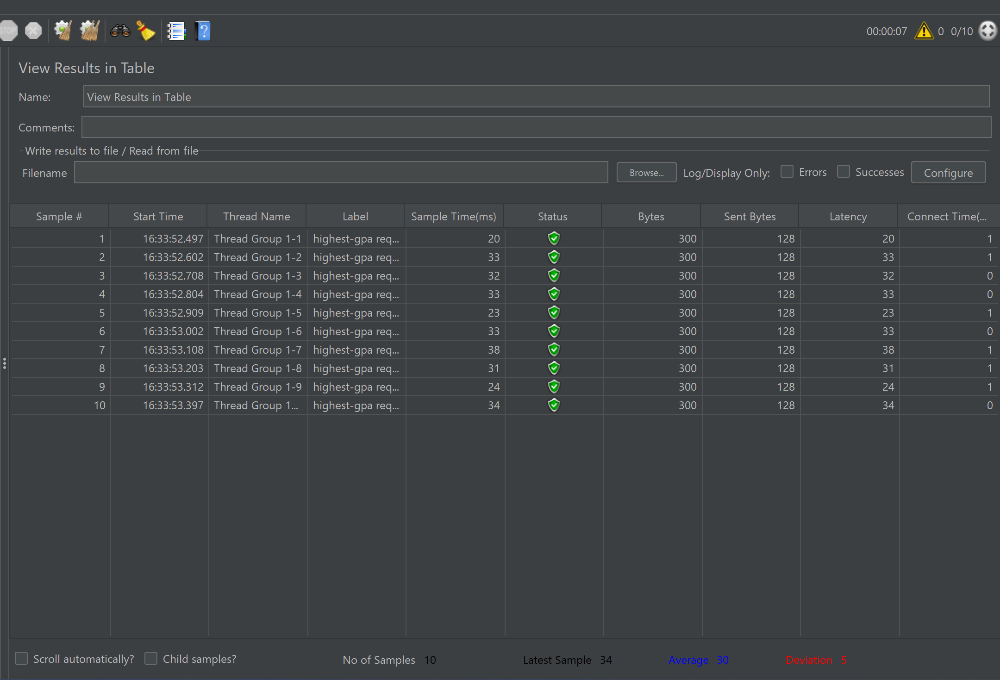

**Bukti Eksekusi JMeter Terminal (CLI):**
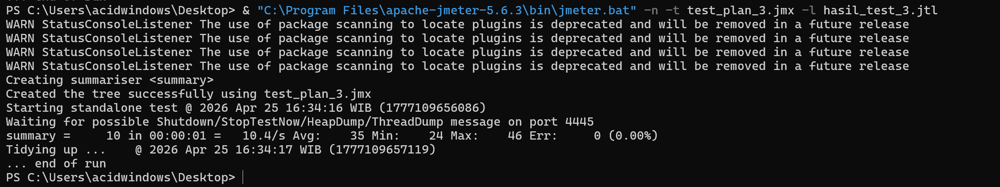

**Hasil JMeter Test Logs:**
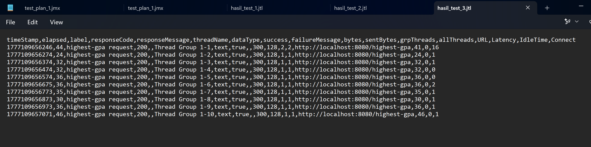

---

## 🚀 After Optimization

Setelah mengidentifikasi masalah pada tahap baseline, dilakukan optimasi pada layer `Repository` dan `Service`. Berikut adalah hasil perbandingan performa setelah dilakukan *refactoring* kode:

### 1. Endpoint `/all-student` (Optimasi N+1 Query)

**Langkah Optimasi:**
Menggunakan teknik **JOIN FETCH** pada `StudentCourseRepository` untuk menarik data `Student` dan `Course` dalam satu *query* tunggal, sehingga menghilangkan 5.000 *query* tambahan yang sebelumnya terjadi.

**Hasil Performa:**
* **Average Load Time:** Turun drastis dari **6.250 ms** menjadi sekitar **80 - 117 ms**.
* **Peningkatan:** >98% lebih cepat.

**Bukti Eksekusi JMeter GUI:**
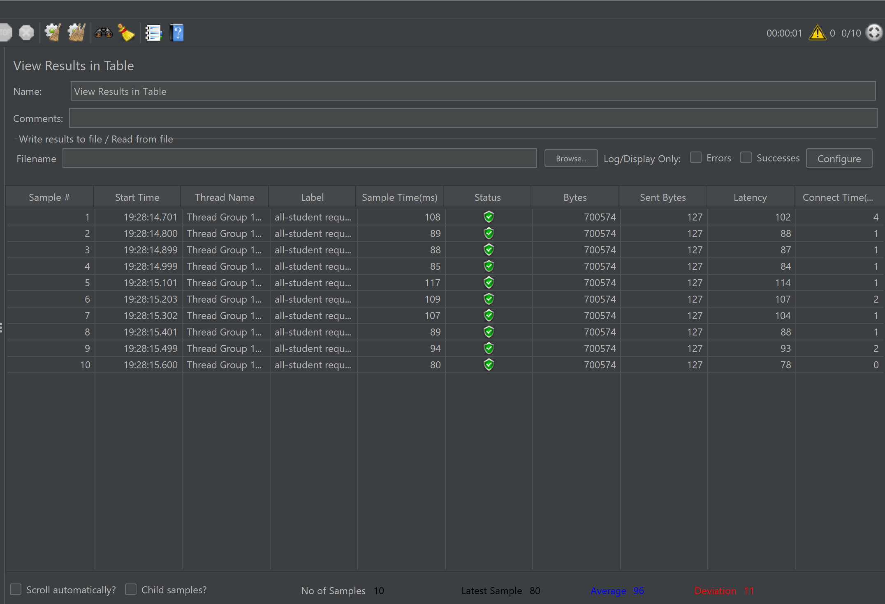

**Hasil JMeter Test Logs:**

---

### 2. Endpoint `/all-student-name` (Optimasi Memori & String)

**Langkah Optimasi:**
1. Menerapkan **Database Projection** untuk hanya mengambil kolom `name` dari database.
2. Mengganti penggabungan string manual (`+=`) dengan **`String.join()`** yang jauh lebih efisien dalam penggunaan memori dan CPU.

**Hasil Performa:**
* **Average Load Time:** Turun dari **52 ms** menjadi sekitar **11 - 12 ms**.
* **Peningkatan:** >75% lebih cepat.

**Bukti Eksekusi JMeter GUI:**
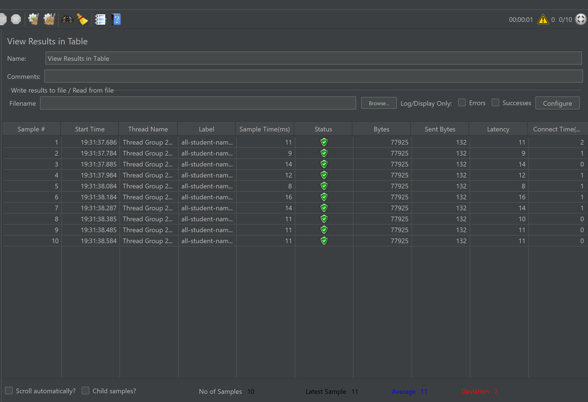

**Hasil JMeter Test Logs:**
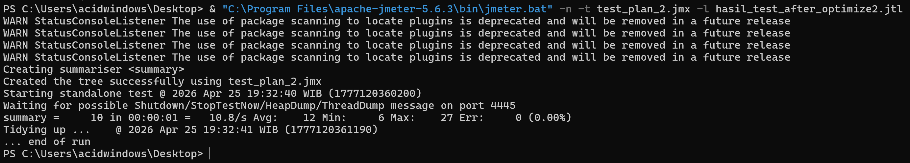

---

### 3. Endpoint `/highest-gpa` (Optimasi Database Sorting)

**Langkah Optimasi:**
Delegasi proses pencarian GPA tertinggi ke database menggunakan fungsi `findFirstByOrderByGpaDesc()`. Aplikasi tidak lagi menarik seluruh data ke RAM, melainkan hanya menerima **1 baris data** hasil sortir dari database.

**Hasil Performa:**
* **Average Load Time:** Turun dari **35 ms** menjadi sekitar **7 - 10 ms**.
* **Peningkatan:** >70% lebih cepat.

**Bukti Eksekusi JMeter GUI:**
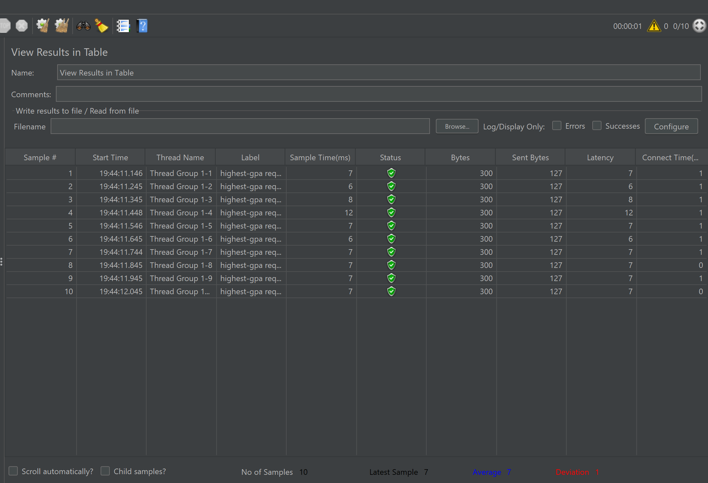

**Hasil JMeter Test Logs:**
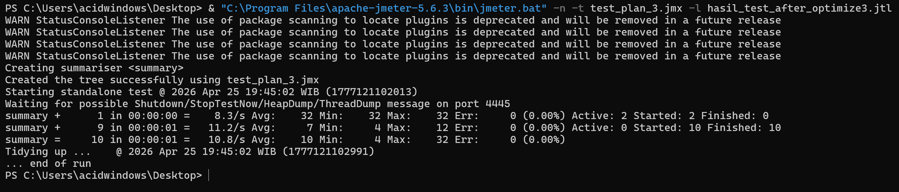

---

## 💡 Kesimpulan
Melalui teknik profiling dan optimasi yang tepat, aplikasi berhasil mencapai target peningkatan performa minimum 20%. Peningkatan paling signifikan terlihat pada endpoint `/all-student` yang berhasil mengatasi masalah I/O bottleneck (N+1 Query), menjadikannya ribuan kali lebih efisien dan siap untuk menangani beban data yang lebih besar.

## 🤔 Reflection 

### 1. What is the difference between the approach of performance testing with JMeter and profiling with IntelliJ Profiler in the context of optimizing application performance?
**JMeter** digunakan untuk menguji performa dari sudut pandang **eksternal** (Black-box testing). Fokusnya adalah mengukur *responsiveness* (waktu respons) dan stabilitas aplikasi saat diberi beban tertentu. Sementara itu, **IntelliJ Profiler** bekerja dari sudut pandang **internal** (White-box testing) untuk melihat bagaimana sumber daya CPU dan memori dialokasikan di dalam kode program saat aplikasi berjalan. Singkatnya, JMeter memberitahu kita *bahwa* aplikasi lambat, sedangkan Profiler memberitahu kita *bagian mana* dari kode yang membuatnya lambat.

### 2. How does the profiling process help you in identifying and understanding the weak points in your application?
Profiling menyediakan visualisasi seperti **Flame Graph** yang menunjukkan tumpukan panggilan metode (*method call stack*). Metode yang memakan waktu eksekusi paling lama akan terlihat sebagai balok yang lebih lebar. Dengan melihat grafik ini, saya dapat melacak apakah keterlambatan disebabkan oleh pemrosesan logika di Java, *query* database yang berlebihan (seperti masalah N+1), atau masalah pada *Garbage Collector*.

### 3. Do you think IntelliJ Profiler is effective in assisting you to analyze and identify bottlenecks in your application code?
Sangat efektif. Tanpa Profiler, mengidentifikasi *bottleneck* hanya didasarkan pada asumsi. Dengan Profiler, saya bisa melihat data aktual penggunaan CPU per milidetik. Contohnya pada endpoint `/all-student`, Profiler dengan jelas menunjukkan bahwa sebagian besar waktu habis untuk pemanggilan metode repository di dalam *loop*, yang merupakan indikasi kuat adanya masalah N+1 Query.

### 4. What are the main challenges you face when conducting performance testing and profiling, and how do you overcome these challenges?
Tantangan utamanya adalah **inkonsistensi data** akibat gangguan proses latar belakang pada laptop (seperti antivirus atau aplikasi lain yang sedang berjalan). Cara mengatasinya adalah dengan melakukan *warming up* (menjalankan tes beberapa kali sebelum mengambil data resmi) dan memastikan lingkungan pengujian sebersih mungkin dari aplikasi lain agar beban CPU murni dari Spring Boot.

### 5. What are the main benefits you gain from using IntelliJ Profiler for profiling your application code?
Manfaat utamanya adalah kemampuan untuk melakukan **identifikasi presisi**. Saya tidak perlu menebak-nebak bagian mana yang harus dioptimasi. Selain itu, fitur visualisasi yang intuitif memudahkan saya untuk membandingkan performa sebelum dan sesudah optimasi secara visual (bukti nyata bahwa balok metode yang tadinya lebar menjadi menyusut).

### 6. How do you handle situations where the results from profiling with IntelliJ Profiler are not entirely consistent with findings from performance testing using JMeter?
Jika JMeter menunjukkan waktu respons yang lama tetapi Profiler menunjukkan penggunaan CPU yang rendah, biasanya masalahnya bukan di kode Java, melainkan pada **eksternalitas** seperti koneksi database yang lambat atau *network latency*. Dalam situasi ini, saya akan mengecek konfigurasi database atau mencari tahu apakah ada proses *blocking* I/O yang tidak tertangkap oleh CPU profiler.

### 7. What strategies do you implement in optimizing application code after analyzing results from performance testing and profiling? How do you ensure the changes you make do not affect the application's functionality?
Strategi saya adalah:
1.  **Prioritas**: Memperbaiki bagian yang memiliki balok terlebar di Profiler (dampak terbesar).
2.  **Refactoring**: Menggunakan teknik seperti *Join Fetch* untuk database atau mengganti struktur data yang lebih efisien.
Untuk memastikan fungsionalitas tetap terjaga, saya melakukan **Unit Testing** atau pengujian manual terhadap output JSON/String dari setiap endpoint untuk memastikan datanya tetap sama (benar) sebelum dan sesudah kode diubah.